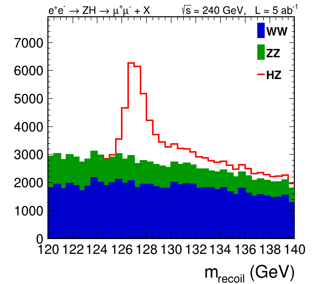

# ExamplesFCCee

Ejemplos de código para empezar a trabajar con sucesos *e+e- -> ZH*  (FCCee) 

El objetivo es seguir [este estudio sobre el recoil del Higgs](https://github.com/HEP-FCC/FCCeePhysicsPerformance/tree/ZH_recoil/case-studies/higgs/mH-recoil)

Vamos a reproducir los plots de la masa del Z->MuMu y del 'retroceso' (recoil, el Higgs) a partir de las muestras FCCee 'reducidas' creadas por Juan Alcaraz y almacenadas en las maquinas del CIEMAT: 

    

El primer paso es empezar a trabajar con las muestras: los primeros ejemplos son más simples. Producen un par de gráficas sencillas (Pt de los Muones, número de muones, etc). 

###  Como correr los ejemplos

Desde una maquina ciemat hay que conectarse a las "user interfaces" del grupo de altas energias (gaeui 0X) en las que correremos: 
```
ssh gaeui01   
```

Descarga el código de este tutorial

```
git clone https://github.com/mcepeda/ExamplesFCCee.git 
cd ExamplesFCCee/
```

Setup de root (necesario cada vez que abras sesión):
```
source /cvmfs/sft.cern.ch/lcg/views/LCG_99/x86_64-centos7-gcc8-opt/setup.sh

```

Corre los ejemplos:

a) Ejemplo con loops (programación "clasica"): 

```
python -i FirstSteps/plot_example_loop.py   
```

b) Ejemplo con dataframes (este es tipo de programación que usaremos):
```
python -i FirstSteps/plot_example_dataframe.py
```

A partir de ellos iremos construyendo el análisis: primero incorporando variables mas complejas (la masa del Z, el recoil) y a continuación corriendo sobre diferentes muestras y normalizandolas a su sección eficaz. 

###  Información de las muestras:

Utilizariamos las siguientes muestras:

- Señal:  e+e- ->ZH  , /afs/ciemat.es/user/a/alcaraz/public/FCCee/eeHZ_skimmed_reduced.root	, cross section = 0.201868 pb 
- Fondo ZZ: e+e- ->ZZ  , /afs/ciemat.es/user/a/alcaraz/public/FCCee/eeZZ_skimmed_reduced.root	, cross section = 1.35899 pb
- Fondo WW: e+e->WW , /afs/ciemat.es/user/a/alcaraz/public/FCCee/eeWW_skimmed_reduced.root ,  cross section = 16.4385 pb

Son versiones 'reducidas' de muestras oficiales FCCee con 10M de sucesos generados con el detector IDEA a 240 GeV (/eos/experiment/fcc/ee/generation/DelphesEvents/spring2021/IDEA/p8_ee_ZH_ecm240/ y equivalentes ZZ y WW). No son todos los fondos relevantes, y hay muestras FCCee más recientes (con mejor simulación), pero son un buen punto de partida.

Para ver la evolución de la sección eficaz con la energía en centro de masas de la colisión:

a)  [Secciones eficaces de e+e-->Higgs, sacadas de "Azzurri, P., Bernardi, G., Braibant, S. et al. A special Higgs challenge: measuring the mass and production cross section with ultimate precision at FCC-ee. Eur. Phys. J. Plus 137, 23 (2022)"](https://link.springer.com/article/10.1140/epjp/s13360-021-02202-4)

[](https://link.springer.com/article/10.1140/epjp/s13360-021-02202-4)

b) [Incluyendo los fondos: secciones eficaces de e+e-, sacadas de "Precision Physics at CEPC, Fenfen An et al 2019 Chinese Phys. C 43 043002"](https://iopscience.iop.org/article/10.1088/1674-1137/43/4/043002)

[](https://iopscience.iop.org/article/10.1088/1674-1137/43/4/043002]])


En estos root trees la informacion guardada es:
```
------------------------------------------------------------------------------------
"NMuon"                : Number of reconstructed muons in the event (int)
"Muon_px"            : X-component of momentum of each muon (in GeV, vector of floats)
"Muon_py"            : Y-component of momentum of each muon (in GeV, vector of floats)
"Muon_pz"            : Z-component of momentum or each muon (in GeV, vector of floats)
"Muon_mass"            : Mass of each muon (vector of floats, actually always 105.7 MeV)
"Muon_charge"        : Charge of each muon (+1 or -1, vector of ints)
"NElectron"            : Number of reconstructed electrons in the event (int)
"Electron_px"        : X-component of momentum of each electron (in GeV, vector of floats)
"Electron_py"        : Y-component of momentum of each electron (in GeV, vector of floats)
"Electron_pz"        : Z-component of momentum of each electron (in GeV, vector of floats)
"Electron_mass"        : Mass of each muon (vector of floats, actually always = 0.511 MeV)
"Electron_charge"    : Charge of each electron (+1 or -1, vector of ints)
"NPhoton"            : Number of reconstructed photons (int)
"Photon_px"            : X-component of momentum of each photon (in GeV, vector of floats)
"Photon_py"            : Y-component of momentum of each photon (in GeV, vector of floats)
"Photon_pz"            : Z-component of momentum of each photon (in GeV, vector of floats)
"NJet"                : Number of reconstructed jets (int, using PFlow objects, ak4 algorithm)
"Jet_px"            : X-component of momentum of each jet (in GeV, vector of floats)
"Jet_py"            : Y-component of momentum of each jet (in GeV, vector of floats)
"Jet_pz"            : Z-component of momentum of each jet (in GeV, vector of floats)
"Jet_mass"            : Mass of each jet (vector of floats)
"Jet_charge"        : Charge of each jet (vector of ints)
"Jet_Nrecoparticles": Number of reconstructed Pflow particles used in the jet
"Missing_px"        : X-component of missing momentum in the event (in GeV, float)
"Missing_py"        : Y-component of missing momentum in the event (in GeV, float)
"Missing_pz"        : Z-component of missing momentum in the event (in GeV, float)
"Simulated_sqrts"    : Center-of-mass energy of the collision (in GeV, around 240 GeV for HZ)
"MCParticle_px"        : px of hard-scattering generated particles (in GeV, vector of floats)
"MCParticle_py"        : py of hard-scattering generated particles (in GeV, vector of floats)
"MCParticle_pz"        : pz of hard-scattering generated particles (in GeV, vector of floats)
"MCParticle_mass"    : mass of hard-scattering generated particles (in GeV, vector of floats)
"MCParticle_PDG"    : PDG id of the generated particle (int)
"MCParticle_parent"    : index of parent particle (-1 if no parent, vector of ints)
-------------------------------------------------------------------------------------------
```

### Paginas web útiles como referencia

Código: 
- ROOT Get Started: https://root.cern/get_started/ 
- Como trabajar con RDataFrames : https://root.cern/doc/master/classROOT_1_1RDataFrame.html 
- Tutoriales de RDataFrames con Root: https://root.cern.ch/doc/master/group__tutorial__dataframe.html 

FCCee full framework: 
- https://github.com/HEP-FCC/FCCeePhysicsPerformance/tree/ZH_recoil/case-studies/higgs/mH-recoil 
- https://github.com/HEP-FCC/FCCAnalyses 

Física: 
- Estudio sobre el recoil: https://indico.cern.ch/event/995850/contributions/4415989/attachments/2272945/3860610/ZHRecoilAnalysis_FCCWeek_29062021.pdf    
- FCCee week: https://indico.cern.ch/event/1066234/ 
