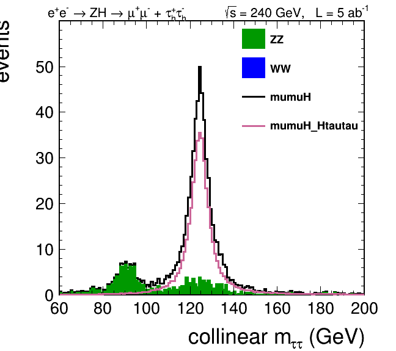

# ZHTauTau

Ejemplos para reconstruir *ee->ZH->MuMuTauTau* y  *ee->ZH->QQTauTau*, a partir de un prototipo de taus hecho en el
framework del FCCee.

El estado final dado como ejemplo selecciona dos taus hadronicos (40% de la
aceptancia). Queda como siguiente paso extender a TauTau+MuTau+ETau modificando la
seleccion. 

El algoritmo de reconstruccion de taus es un prototipo y esta en desarrollo.

 

Los ultimos trees estan en las gaeui0X, en "/nfs/cms/cepeda/FCC/taus16Feb_eekt4Jets_idInJet/"

Ejemplo MuMuTauTau:

```
# To create the histograms:
python runMuMuTauTau.py 

# To make the plots:
python pintarMuMuTauTau.py
```


